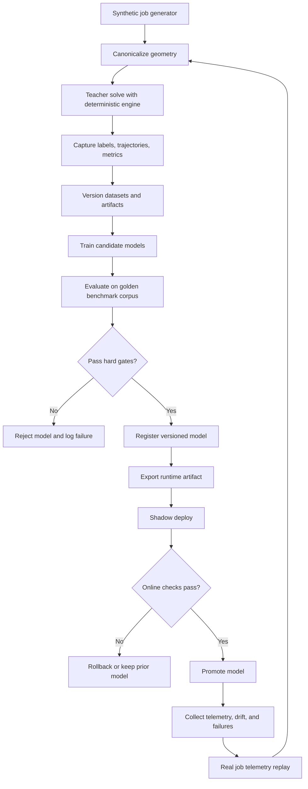

# Autopilot Training Architecture

## Goal

Automate the training loop as much as possible without allowing silent model regressions into production.

Autopilot here means:

- automatic data generation
- automatic labeling
- automatic training
- automatic evaluation
- automatic packaging
- automatic shadow rollout

Autopilot does not mean:

- unconditional production promotion

## Principle

Training can run on autopilot.
Promotion should remain gated.

## End-To-End Loop

## Main Components

## 1. Data generation

Two sources should feed the pipeline:

- synthetic jobs
- replayed real jobs

Synthetic jobs provide coverage and scale.
Real jobs anchor the training distribution to actual production behavior.

## 2. Teacher labeling

The current deterministic solver generates:

- job outcomes
- best-found placements
- candidate rankings
- solver trajectories
- runtime measurements
- utilization and waste metrics

This is the heart of the training signal.

## 3. Dataset and artifact versioning

Every training run should be reproducible.

Track:

- generator version
- solver version
- config version
- dataset slices
- feature schema
- model artifact lineage

## 4. Training jobs

Initial autopilot-friendly models:

- config recommender
- GA seed model
- candidate ranker
- surrogate fitness model

Later:

- placement proposal model
- difficulty prediction
- fallback routing policies

## 5. Evaluation

Every model candidate should be tested on a fixed golden benchmark set plus rotating challenge sets.

Evaluation should measure:

- legality
- utilization
- sheet count
- runtime
- merged-line savings
- robustness on difficult geometry slices

## 6. Registry and packaging

Only evaluated models should be registered.

Runtime artifacts should be exported in a stable deployment format so the app never depends on training code.

## 7. Shadow rollout

New models should first run in shadow mode:

- make recommendations
- do not control the user-visible result yet
- compare against baseline decisions
- log deltas

## Hard Promotion Gates

A model should not promote unless it meets all applicable gates.

- legality must not regress
- utilization must be equal or better within target thresholds
- runtime must improve or justify the quality increase
- performance on rare geometry slices must stay within budget
- fallback activation rate must remain acceptable
- online shadow metrics must match offline expectations

## Safety Rules

- every model decision must have a confidence threshold
- low-confidence outputs must defer to the deterministic baseline
- every production model must have a rollback path
- no model should become the sole legality authority

## What Can Be Fully Automated

- synthetic job generation
- teacher solving
- feature extraction
- model training
- hyperparameter sweeps
- evaluation reports
- artifact export
- shadow deployment
- drift detection
- retraining triggers

## What Should Stay Gated

- default production promotion
- reward function changes
- data distribution changes
- benchmark definition changes
- legality rule changes

## Recommended Operational Rhythm

- per commit or nightly: small synthetic refresh and smoke training
- nightly: standard training and evaluation runs
- weekly: broad benchmark sweep and challenge-set evaluation
- continuous: shadow telemetry and drift monitoring

## Minimal First Autopilot

If we want the smallest viable system first, automate this:

1. generate synthetic jobs
2. solve with baseline teacher
3. train config recommender
4. evaluate against fixed benchmark jobs
5. export model artifact
6. run shadow predictions

This gives us a real ML loop without risking the nesting core.

## Production Philosophy

Autopilot should accelerate learning.
It should not remove engineering judgment where regressions would be expensive.
