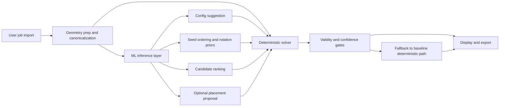

# ML Modernization Strategy

## Goal

Turn Deepnest++ into a modern ML-assisted nesting system while preserving the deterministic geometry engine that already solves the hard validity problems.

This should be treated as a hybrid system, not a full replacement.

## Core Position

We should not start over from scratch on the solver.

We should:

- keep the current deterministic nesting logic as the trusted baseline
- use it as a teacher to generate data
- use it as a validator for ML outputs
- use it as a fallback when ML is uncertain
- gradually rebuild the outer architecture around cleaner interfaces

In plain terms:

`reuse the solver, replace the shell, layer in ML gradually`

## Why This Direction Fits The Current Repo

The repo already contains valuable domain logic in the active execution path:

- `main/deepnest.js`
- `main/background.js`
- `main/svgparser.js`
- `main/util/geometryutil.js`
- `minkowski.cc`

These files contain the real nesting knowledge:

- import and polygon preparation
- hole and containment handling
- no-fit-polygon logic
- placement search
- scoring
- export behavior

The weaker part of the current app is the old platform shell:

- Electron 1.x era runtime
- hidden background window orchestration
- tightly coupled renderer scripts
- dated native build assumptions

That means the architecture should evolve, but the solver knowledge should be preserved.

## What ML Should Do First

Use ML to improve expensive decisions, not legality.

Good first ML tasks:

- config recommendation
- GA seeding
- candidate ranking
- surrogate fitness prediction

Later ML tasks:

- next-part placement proposals
- learned job difficulty prediction
- learned import cleanup hints
- optional generative packing proposals

What ML should not own first:

- final collision legality
- sheet-boundary legality
- export correctness
- core polygon validity

## Target Hybrid Runtime

## Training Relationship

The current deterministic solver becomes:

- the teacher
- the benchmark
- the regression oracle
- the fallback

This matters because nesting is a combinatorial optimization problem with hard constraints. The current engine already knows how to produce legal nests. That gives us a direct path to synthetic data generation and supervised or imitation-style learning.

## Suggested Implementation Phases

## Phase 0

Stabilize understanding and interfaces.

- document the active code path
- define canonical job and result schemas
- isolate a headless nesting API from UI concerns

## Phase 1

Make the current engine observable.

- log job features
- log solver settings
- log search trajectories
- log placements, utilization, runtime, and merged-line savings

## Phase 2

Introduce low-risk ML.

- model for config recommendation
- model for initial GA seeding

These should improve speed or starting quality without changing legality.

## Phase 3

Add decision-support models.

- candidate ranker
- surrogate fitness model

These should decide which candidates deserve full deterministic evaluation.

## Phase 4

Introduce proposal models.

- next-part proposal
- rotation proposal
- rough position proposal

The deterministic engine still confirms validity.

## Phase 5

Explore end-to-end learned packing only after the hybrid system is stable.

- diffusion or gradient-field proposal models
- RL or imitation-based placement policies
- learned solvers behind strict fallback gates

## Architectural Rules

- the deterministic engine remains the source of truth for legality
- every ML decision must be optional and replaceable
- every ML output must be measurable against the current baseline
- fallback must always exist
- no model should be trusted without golden-benchmark evaluation

## What We Should Preserve

- polygon and hole handling behavior
- import to nest to export flow
- NFP correctness
- merged-line behavior
- deterministic benchmarking capability

## What We Should Rebuild

- runtime shell
- process boundaries
- model-serving layer
- telemetry
- training pipeline
- dataset tooling

## Anti-Patterns To Avoid

- deleting the current solver before ML is proven
- replacing geometry legality with probabilistic inference
- training only on final best nests and ignoring search traces
- introducing ML without a benchmark corpus
- coupling training code into the desktop runtime

## North Star

Deepnest++ should evolve into:

- a deterministic geometry engine at the core
- a modern ML-assisted optimizer around it
- a continuously improving system fed by synthetic and real jobs
- a safe product that can always fall back to known-good behavior
