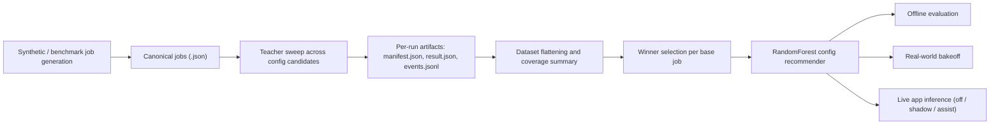

# Deepnest ML Tooling

This folder contains the phase-1 ML readiness implementation:

- canonical schemas
- headless teacher runner around the existing solver
- synthetic and benchmark job generation
- dataset and feature pipelines
- offline config recommender tooling
- local-only real-world corpus packaging and bakeoff tooling
- dashboard and DuckDB warehouse helpers

## Quick Start

1. Install the Node dependencies from the repo root:

```bash
npm install
```

2. Install the Python dependencies:

```bash
python3 -m pip install -r ml/python/requirements.txt
```

3. Generate a benchmark corpus:

```bash
npm run ml:benchmark -- --output-dir ml/artifacts/benchmark
```

4. Run one canonical job through the headless teacher:

```bash
npm run ml:teacher -- --job ml/examples/simple-job.json --output-dir ml/artifacts/runs/simple
```

5. Build a dataset:

```bash
npm run ml:dataset -- --runs-root ml/artifacts/runs --output-dir ml/artifacts/datasets/latest
```

6. Materialize a DuckDB warehouse and launch the dashboard:

```bash
npm run ml:duckdb -- --runs-root ml/artifacts/runs --dataset-parquet ml/artifacts/datasets/latest/dataset.parquet --output ml/artifacts/warehouse/deepnest.duckdb
npm run ml:dashboard -- -- --warehouse ml/artifacts/warehouse/deepnest.duckdb
```

## Integrated Control Tower

You can now launch a full local training run from the dashboard:

```bash
python3 -m streamlit run ml/python/dashboard/app.py
```

The control tower lets you:

- choose a preset or custom job counts
- click `Start Training Pipeline`
- click `Run Real-World Bakeoff` with a manifest and trained model
- monitor stage progress and logs
- inspect the selected run's metrics once the warehouse is built

You can also launch the same pipeline from the terminal:

```bash
npm run ml:pipeline -- --preset quick
```

To package canonical jobs into a local-only real-world corpus:

```bash
npm run ml:package-real-world -- --campaign-id historical-q2 --jobs-root ml/artifacts/some-canonical-jobs
```

To run the offline bakeoff against a trained config recommender:

```bash
npm run ml:bakeoff -- \
  --manifest ml/artifacts/real_world/historical-q2/real_world_manifest.json \
  --model ml/artifacts/pipeline_runs/<training-run>/model/config_recommender.pkl \
  --output-dir ml/artifacts/real_world_bakeoffs/historical-q2-eval
```

An example manifest shape is checked in at [ml/examples/real_world_manifest.example.json](/Users/abrahamsaenz/Desktop/Deepnest++/ml/examples/real_world_manifest.example.json).

## ML System Handoff

This section is the technical handoff for another AI or engineer. It describes the system as it exists in the repository today, including the current model boundary, how training labels are produced, which files own which parts of the pipeline, and the Apple Silicon/runtime constraints that matter during local runs.

### What The ML System Actually Does

The current ML implementation is an **offline config-selection system**, not an end-to-end neural nesting engine.

- The deterministic Deepnest solver remains the legality and placement authority.
- The ML model does **not** place parts directly.
- The model learns to predict which **config candidate** is most likely to perform best for a given canonical job.
- The teacher signal comes from running the real solver multiple times per job, once for each config candidate, then selecting the best legal outcome.

In practical terms:

- input to ML: a canonical job JSON
- label target: `config_candidate_id`
- runtime authority: deterministic solver + legality checks
- live-app use: recommend a better config, optionally apply it in `assist` mode

### End-To-End Flow



### System Boundaries

These boundaries are important and should not be blurred accidentally:

- **Canonical schema boundary**
  Every training/evaluation job must pass through the canonical job/result schemas. The schema utilities live in `ml/python/deepnest_ml/schema.py`.
- **Teacher boundary**
  Labels are not synthetic heuristics. They are produced by the hidden Electron teacher running the actual app/solver path.
- **Model boundary**
  The current production-ish model is a `RandomForestClassifier` trained on job-level scalar features. No graph model, image model, or per-part placement policy is active.
- **Live inference boundary**
  The live predictor can suggest or apply a config candidate, but legality is still decided by the normal solver path.

### ML Process Protection

The ML process is a protected system. App/runtime work must not silently degrade it.

- Do not assume a desktop-app performance fix is automatically safe for the teacher harness.
- Treat `main.js`, `main/background.js`, `addon.cc`, `minkowski.cc`, `ml/teacher-main.js`, and `ml/app-smoke-main.js` as ML-sensitive integration points.
- If a change touches native execution, background orchestration, packaging, or solver config application, verify both:
  - the visible desktop app workflow
  - the teacher/training workflow that writes `manifest.json`, `result.json`, and `events.jsonl`
- Do not accept a change that lowers teacher stability, legality rate, artifact completeness, or cross-candidate comparability unless the ML baseline is being intentionally re-established.
- Performance improvements are good, but protecting the teacher signal is more important than a local speedup.

### File Ownership Map

If another AI needs to extend or debug the system, these are the first files to read:

- `ml/python/deepnest_ml/control_tower.py`
  Control-tower orchestration, run specs, preset defaults, native-vs-legacy runtime selection, stage execution.
- `ml/python/dashboard/app.py`
  Streamlit UI for training, bakeoff, runtime status, profile selection, and custom profile editing.
- `ml/python/deepnest_ml/job_generator.py`
  Synthetic corpus generation, default solver config, current synthetic shape families, per-profile config randomization.
- `ml/python/deepnest_ml/training_profiles.py`
  Built-in/custom training profile registry. Current custom profile support is family-based, not full SVG shape-library item selection.
- `ml/python/scripts/run_config_sweep.py`
  Teacher sweep launcher. Expands `job x config candidate`, runs retries, tracks failures, supports parallel workers and solver-thread overrides.
- `ml/cli/run_teacher.js`
  Node launcher that picks the Electron binary and starts the headless teacher harness.
- `ml/teacher-main.js`
  Hidden Electron main process for teacher execution. Loads the real renderer path plus hidden background window, forwards synchronous native addon requests, disables GPU in headless mode.
- `main/index.html`
  The canonical teacher automation actually runs here, through the real app renderer path.
- `main/background.html` and `main/background.js`
  Hidden background nesting worker used by both the app and the teacher path.
- `ml/python/deepnest_ml/dataset.py`
  Collects teacher outputs and writes `dataset.parquet`, `dataset.jsonl`, and `summary.json`.
- `ml/python/deepnest_ml/features.py`
  Defines the job-level feature extraction and run flattening logic.
- `ml/python/deepnest_ml/training.py`
  Winner selection, preflight checks, model fitting, evaluation, and model artifact emission.
- `ml/python/deepnest_ml/bakeoff.py`
  Real-world offline evaluation against a packaged corpus.
- `ml/config_candidates.json`
  Candidate config set that the classifier predicts over.

### Canonical Artifacts And Lineage

The training pipeline is artifact-driven. Another AI should reason from the artifacts backward when debugging.

#### Per teacher run

Each teacher execution writes an output directory containing:

- `job.json`
  The canonical job actually evaluated.
- `result.json`
  Solver outcome, legality block, metrics, timings, and failure reason when present.
- `events.jsonl`
  Teacher-side event stream useful for debugging hidden renderer runs.
- `manifest.json`
  The canonical pointer file that ties together the run metadata and artifact paths.

#### Dataset output

Dataset materialization writes:

- `dataset.parquet`
- `dataset.jsonl`
- `summary.json`

`summary.json` includes coverage information such as:

- row count
- base job count
- legal row count
- failed row count
- legal base job count
- legal rate
- size/density/duplicate coverage bands

#### Model output

Training emits:

- `config_recommender.pkl`
  Pickled bundle containing:
  - `model`
  - `feature_columns`
- `training_report.json`
  Contains train/test sizes, test accuracy, feature importances, and random-forest parallelism metadata.

### Training Pipeline In Detail

#### 1. Synthetic and benchmark job generation

Synthetic jobs are generated in `ml/python/deepnest_ml/job_generator.py`.

The current synthetic generator is still **family-based**. The allowed families today are:

- `rect`
- `l`
- `t`
- `holey`
- `star`

Built-in training profiles are defined in `ml/python/deepnest_ml/training_profiles.py`:

- `rect_sparse`
- `duplicate_heavy`
- `concave_mix`
- `hole_mix`
- `mixed_scale`

Custom profiles are persisted at:

- `ml/artifacts/training_profiles/custom_profiles.json`

Important current limitation:

- the custom profile builder in the control tower edits **family mixes and parameter choices**
- it does **not** yet operate on a full item-by-item SVG shape library

Per synthetic job, the generator randomizes:

- quantities
- budget (`max_evaluations`)
- `populationSize`
- `mutationRate`
- `rotations`
- `curveTolerance`
- `threads`
- optional placement type / merge-lines overrides

The default canonical config baseline in the generator is:

- spacing `0`
- curve tolerance `0.3`
- rotations `4`
- population size `10`
- mutation rate `10`
- threads `1`
- placement type `gravity`
- merge lines `true`

#### 2. Teacher execution and label generation

The teacher path is intentionally close to the real application path.

Execution chain:

1. `run_config_sweep.py` writes a candidate-specific job variant.
2. It launches `node ml/cli/run_teacher.js`.
3. `run_teacher.js` resolves the Electron binary, then spawns `ml/teacher-main.js`.
4. `teacher-main.js` creates:
   - a hidden teacher window loading `main/index.html`
   - a hidden background window loading `main/background.html`
5. The renderer automation in `main/index.html` imports the canonical job, starts the real solver path, waits for completion, and writes run artifacts.

This matters because the label source is **not** a detached toy solver. It is the same import -> nest -> result path the desktop app relies on.

#### 3. Config sweep semantics

`ml/python/scripts/run_config_sweep.py` is the label generator.

For every canonical job:

- load every candidate from `ml/config_candidates.json`
- clone the base job
- stamp:
  - `job_id = <base_job_id>__<candidate_id>`
  - `metadata.base_job_id`
  - `metadata.config_candidate_id`
- merge the candidate config into `job["config"]`
- optionally override `config["threads"]` when `--solver-threads` is set

The sweep currently supports:

- parallel worker count via `--workers`
- solver thread override via `--solver-threads`
- timeout via `--timeout-seconds`
- retry count via `--max-attempts`

Current hardening in the sweep:

- each teacher child runs in its own process group
- timeout kills the whole process group
- retries back off gently instead of relaunching immediately
- failures are appended to `sweep_failures.jsonl`
- sweep summary is written to `sweep_summary.json`

#### 4. Dataset flattening

`ml/python/deepnest_ml/dataset.py` walks all `manifest.json` files under a runs root, then:

- loads `job.json`
- loads `result.json`
- validates both against schema
- flattens them into tabular rows via `flatten_run(...)`

`flatten_run(...)` in `features.py` combines:

- job-level geometry/config features
- run identity
- candidate identity
- legality fields
- timing fields
- solver metrics

The row target space is therefore one row per:

- `base_job_id`
- `config_candidate_id`
- teacher execution

#### 5. Winner selection

The classifier is trained on the **best legal candidate per base job**, not on every row equally.

`select_best_config_rows(...)` in `training.py`:

- filters to legal rows only
- sorts by:
  - `base_job_id` ascending
  - `used_sheet_count` ascending
  - `fitness` ascending
  - `utilization_ratio` descending
  - `wall_clock_ms` ascending
- takes the first row per `base_job_id`

So the current teacher preference is:

1. fewer sheets
2. then lower fitness
3. then better utilization ratio
4. then lower runtime as a tie-breaker

This is intentionally compactness-first. Runtime still matters, but it is no longer the primary label signal.

#### 6. Feature extraction

The feature extractor in `ml/python/deepnest_ml/features.py` computes many scalar descriptors from canonical jobs.

The **current training feature vector** in `training.py` is:

- `part_catalog_count`
- `sheet_catalog_count`
- `expected_part_count`
- `expected_sheet_count`
- `total_part_area`
- `total_sheet_area`
- `target_density`
- `total_holes`
- `hole_part_fraction`
- `avg_vertices`
- `max_vertices`
- `avg_bbox_aspect`
- `max_bbox_aspect`
- `min_part_area`
- `max_part_area`
- `area_spread_ratio`
- `duplicate_ratio`

Important nuance:

`extract_job_features(...)` also computes config fields such as:

- `population_size`
- `mutation_rate`
- `rotations`
- `curve_tolerance`
- `spacing`

but these are **not currently included** in `FEATURE_COLUMNS`, so they are **not** part of the classifier input at the moment.

This is especially relevant for rotation work:

- today, rotation primarily influences the label through the candidate config set
- it is not yet modeled explicitly as an input feature

#### 7. Model training

The current trainer in `ml/python/deepnest_ml/training.py` fits a:

- `RandomForestClassifier`
  - `n_estimators = 200`
  - `class_weight = "balanced"`
  - `random_state = 42`

Training guardrails:

- fail if there are no legal rows
- fail if there are too few legal base jobs for a real split
- fail if fewer than `4` winner rows survive selection
- fail if there is only one winning config class

The train/test split is:

- `test_size = 0.25`
- `random_state = 42`
- stratified only when class counts make that possible

#### 8. Model evaluation

The evaluation stage compares predicted candidates to the known teacher winners in the dataset.

It reports:

- exact candidate match accuracy on the held-out set
- delta vs default config
- predicted-row metrics vs actual best-row metrics

This is still a relatively simple offline evaluation. The stronger acceptance gate is the real-world bakeoff described below.

### Config Candidate Space

The classifier predicts over the discrete candidate set in `ml/config_candidates.json`.

Current candidates:

- `default`
- `fast_box`
- `quality_dense`
- `convex_fast`
- `merge_focused`

Current policy notes:

- all sweep candidates now use **4 rotations**
- all sweep candidates default to **1 solver thread**
- the compactness-oriented candidates keep `simplify: false`
- `convex_fast` is a legacy candidate id kept for compatibility, but its config is now compactness-oriented rather than convex-hull-first

This means any model change that expands or renames candidates must also account for:

- sweep generation
- dataset labels
- trained model compatibility
- live inference lookup
- bakeoff comparisons

### Control Tower And Presets

The main orchestrator is `ml/python/deepnest_ml/control_tower.py`, surfaced through the Streamlit app in `ml/python/dashboard/app.py`.

Current training presets are:

- `quick`
  - synthetic `12`
  - benchmark `0`
- `standard`
  - synthetic `50`
  - benchmark `10`
- `overnight`
  - synthetic `200`
  - benchmark `25`
- `custom`
  - synthetic `24`
  - benchmark `4`

The control tower also stores:

- selected training profiles
- sweep worker count
- solver thread count
- chosen Electron binary

The pipeline entry point is:

- terminal: `ml/python/scripts/run_training_pipeline.py`
- dashboard: `ml/python/dashboard/app.py`

### Real-World Bakeoff

`ml/python/deepnest_ml/bakeoff.py` is the acceptance-style offline evaluator.

It packages a local-only real-world corpus from canonical jobs, then compares:

- **baseline**
  the repository default candidate
- **predicted**
  the model-picked candidate
- **oracle**
  the best legal candidate found by a full sweep

Manifest versioning:

- `REAL_WORLD_MANIFEST_VERSION = "1.0.0"`
- `REAL_WORLD_BAKEOFF_REPORT_VERSION = "1.0.0"`

Allowed real-world splits today:

- `smoke`
- `acceptance`

This is the correct place to measure whether offline classifier improvements actually transfer to jobs that were not synthesized by the generator.

### Live App Integration

The live predictor bridge is in:

- `ml/live/live-inference.js`

It shells out to the Python predictor and supports three modes:

- `off`
- `shadow`
- `assist`

Interpretation:

- `off`
  no ML interaction
- `shadow`
  run the predictor and log/report the recommendation without changing the nesting config
- `assist`
  apply the predicted candidate config before nesting

This is intentionally conservative. It lets the app consume ML recommendations without bypassing the deterministic solver.

### Apple Silicon And Runtime Notes

This repository currently has two materially different runtime paths:

- native modern Electron from `node_modules/electron`
- legacy x64 Electron under `.legacy/.../Electron.app`

For Apple Silicon training, the intended default is the **native** runtime. `control_tower.py` resolves that at launch time through `resolve_default_electron_binary()`.

Operationally important details:

- the headless teacher disables GPU acceleration because hidden training windows do not benefit from it and helper-process churn on Apple Silicon has been unstable
- the teacher launcher sets `ApplePersistenceIgnoreState=YES` to avoid the macOS “reopen windows” crash dialog blocking retries
- random-forest fit parallelism is Apple-Silicon-aware and prefers performance-core counts when available
- synthetic job generation now defaults to `1` solver thread to keep compactness labels stable and reduce timing-noise bias

Environment variables worth knowing:

- `DEEPNEST_ELECTRON_BINARY`
  force a specific Electron binary
- `DEEPNEST_ML_RF_JOBS`
  override random-forest fit parallelism
- `DEEPNEST_ML_SOLVER_THREADS`
  override default solver thread count during job generation
- `DEEPNEST_TEACHER_DEBUG=1`
  enable verbose hidden-teacher logging

### Known Failure Modes

Another AI should know these are real operational concerns, not theoretical ones:

- **Native addon crashes in hole-heavy geometry**
  The Minkowski/Boost path in `minkowski.cc` has historically been sensitive to degenerate hole rings. Recent hardening sanitizes duplicate points, closing duplicates, and collinear points before passing rings into Boost, but hole-heavy jobs are still the first place to investigate if native teacher runs start segfaulting again.
- **Runtime confusion between native and legacy Electron**
  Training speed and behavior change dramatically depending on which Electron binary is being used. Always verify the resolved binary when diagnosing slow overnight runs.
- **Small datasets fail preflight**
  Quick runs can fail training if there are too few legal base jobs or too little winner diversity.
- **Live predictor compatibility depends on candidate-set consistency**
  If candidate IDs change, old models may still deserialize but produce invalid downstream assumptions.

### Safe Places To Change Behavior

If another AI needs to evolve the system, these are the intended change points:

- to change synthetic workload mix:
  edit `training_profiles.py` and `job_generator.py`
- to add richer geometry features:
  edit `features.py`, then update `FEATURE_COLUMNS` in `training.py`, then retrain
- to change label semantics:
  edit `select_best_config_rows(...)` in `training.py`
- to add/remove config candidates:
  edit `ml/config_candidates.json`, then regenerate sweeps/datasets/models
- to change training orchestration or runtime defaults:
  edit `control_tower.py` and `run_training_pipeline.py`
- to debug teacher runtime failures:
  inspect `run_config_sweep.py`, `run_teacher.js`, `teacher-main.js`, `main/index.html`, and run artifacts under `ml/artifacts/pipeline_runs/...`
- to improve real-world acceptance logic:
  edit `bakeoff.py`

### Recommended First Read For A New AI

If a different AI is taking over, the shortest useful reading order is:

1. `ml/README.md`
2. `ml/python/deepnest_ml/control_tower.py`
3. `ml/python/scripts/run_config_sweep.py`
4. `ml/teacher-main.js`
5. `main/index.html`
6. `ml/python/deepnest_ml/job_generator.py`
7. `ml/python/deepnest_ml/features.py`
8. `ml/python/deepnest_ml/training.py`
9. `ml/python/deepnest_ml/bakeoff.py`

That sequence gives the new agent:

- runtime and artifact flow first
- then label generation
- then feature/model assumptions
- then acceptance evaluation

## Checkpointing A Good Baseline

Training runs are already additive because every control-tower run gets its own timestamped directory under `ml/artifacts/pipeline_runs`. If you want an explicit named backup before changing the synthetic generator or candidate set, create a checkpoint:

```bash
npm run ml:checkpoint -- --name pre-simple-shape-expansion
```

That snapshots:

- the latest completed training run with a model
- the current `ml/config_candidates.json`
- the key training/generator source files
- existing bakeoff report JSONs

You can also pin a specific completed run:

```bash
npm run ml:checkpoint -- --name baseline-20260402 --run-id 20260402-111305-standard
```

Checkpoints are stored under `ml/artifacts/checkpoints/<timestamp>-<name>/manifest.json`.

## Notes

- The deterministic solver remains the legality authority.
- The headless runner is additive and does not replace the user-facing app.
- Config recommender training is offline-only in phase 1.

## Legacy Runtime

On Apple Silicon and newer macOS releases, the original Electron 1.4 app works best through the legacy runtime helper:

```bash
npm run legacy:setup
npm run legacy:start
```

To run the headless teacher against that runtime:

```bash
npm run legacy:teacher -- --job ml/examples/simple-job.json --output-dir ml/artifacts/runs/simple
```

To run the real app-path smoke test through the Electron renderer:

```bash
npm run legacy:app-smoke -- \
  --input /Users/abrahamsaenz/Desktop/Deepnest++/ml/examples/app-smoke.svg \
  --output /Users/abrahamsaenz/Desktop/Deepnest++/ml/artifacts/app_smoke/export.svg \
  --report /Users/abrahamsaenz/Desktop/Deepnest++/ml/artifacts/app_smoke/report.json
```

This exercises the normal import -> nest -> export path without native file dialogs by using a tiny renderer-only automation hook that is idle during regular app use.

To exercise the same smoke path with live ML recommendation enabled:

```bash
npm run legacy:app-smoke -- \
  --input /Users/abrahamsaenz/Desktop/Deepnest++/ml/examples/app-smoke.svg \
  --output /Users/abrahamsaenz/Desktop/Deepnest++/ml/artifacts/app_smoke/export-ml.svg \
  --report /Users/abrahamsaenz/Desktop/Deepnest++/ml/artifacts/app_smoke/report-ml.json \
  --mlMode shadow
```

Use `--mlMode assist` to apply the predicted candidate config during the smoke run, and `--mlModelPath /absolute/path/to/config_recommender.pkl` to pin a specific trained model instead of auto-detecting the latest one.

When the app is running through the legacy x64 Electron path on Apple Silicon, the live predictor automatically launches the Python model process through native `arm64` so local `scikit-learn` wheels still load correctly.
